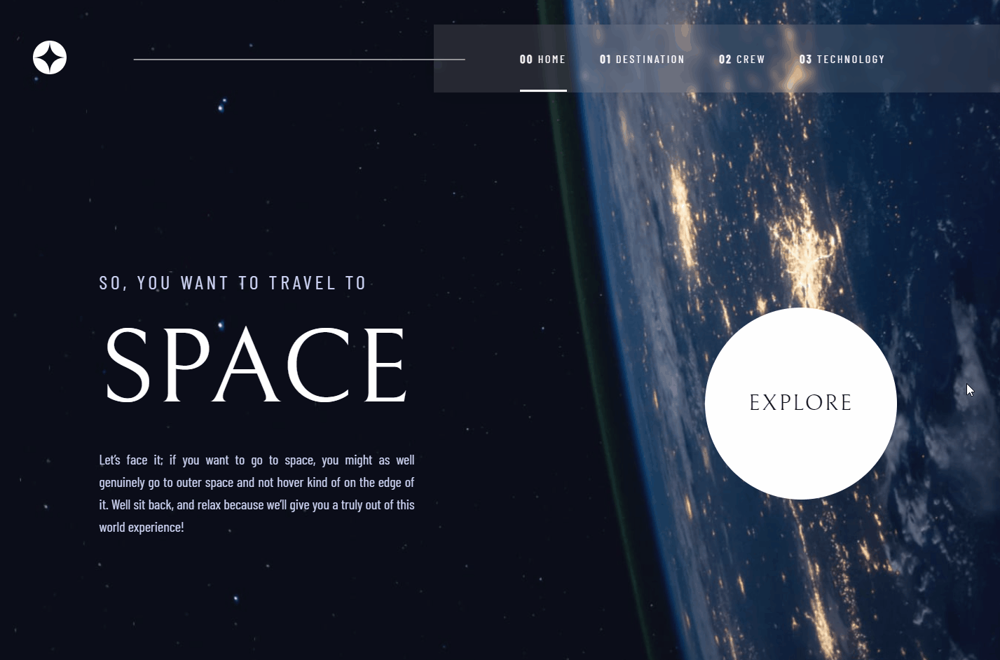

# Frontend Mentor - Space tourism website 

Esta é uma solução para o [Space tourism website challenge on Frontend Mentor](https://www.frontendmentor.io/challenges/space-tourism-multipage-website-gRWj1URZ3).

### Descrição

O desafio consiste em criar um site de turismo espacial com várias páginas responsivas e interativas, onde os usuários possam visualizar informações sobre destinos, a equipe de tripulação, tecnologias espaciais e muito mais.

### Captura de tela

### Links

- [Solução](https://github.com/flaviafigueredo/space-tourism-website)
- [Deploy]()

### Tecnologias Utilizadas

- **Vite**: Projeto criado com Vite para inicialização rápida e desenvolvimento eficiente.
- **React**: Utilizado para construir a aplicação frontend de forma eficiente e modular.
- **Styled Components**: Usado para estilizar os componentes de forma modular e escalável.
- **React Router DOM**: Utilizado para o roteamento entre as diferentes páginas do site.
- **React Burger Menu**: Implementação do menu de navegação responsivo.
- **Hooks useState e useEffect**: Utilizado para gerenciar o estado e os efeitos colaterais na aplicação.
- **JavaScript**: Linguagem de programação principal para a lógica da aplicação.

### Executando o projeto

Para executar o projeto localmente, siga estas etapas:

1. Clone o repositório para o seu ambiente de desenvolvimento.

2. Instale as dependências do projeto:

        npm install

    ou

        yarn install

3. Inicie o servidor de desenvolvimento com Vite:

        npm run dev

    ou

        yarn dev

## Autora

- [Portfólio](https://flaviafigueredo.github.io/portfolio/)